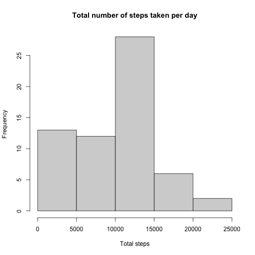
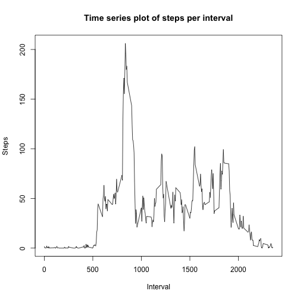
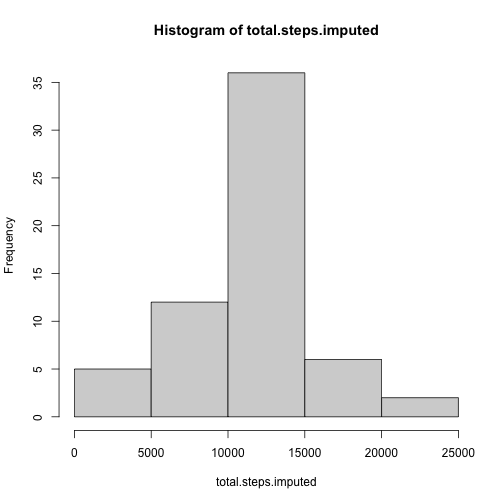
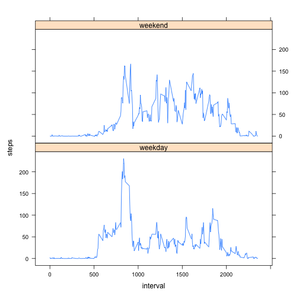

## Library


```r
library(tidyverse)
library(lattice)
```


## Loading and preprocessing the data

Imported the data file:


```r
unzip("activity.zip")
activity <- read.csv("activity.csv")
```

Tidy the data in preparation for analysis


```r
activity$date <- as.Date(activity$date, "%Y-%m-%d")
```


## What is mean total number of steps taken per day?

Calculating the total number of steps per day:


```r
total.steps <- tapply(activity$steps, as.factor(activity$date), sum, na.rm = TRUE)

#Total number of steps taken per day
total.steps
```

```
## 2012-10-01 2012-10-02 2012-10-03 2012-10-04 2012-10-05 2012-10-06 2012-10-07 
##          0        126      11352      12116      13294      15420      11015 
## 2012-10-08 2012-10-09 2012-10-10 2012-10-11 2012-10-12 2012-10-13 2012-10-14 
##          0      12811       9900      10304      17382      12426      15098 
## 2012-10-15 2012-10-16 2012-10-17 2012-10-18 2012-10-19 2012-10-20 2012-10-21 
##      10139      15084      13452      10056      11829      10395       8821 
## 2012-10-22 2012-10-23 2012-10-24 2012-10-25 2012-10-26 2012-10-27 2012-10-28 
##      13460       8918       8355       2492       6778      10119      11458 
## 2012-10-29 2012-10-30 2012-10-31 2012-11-01 2012-11-02 2012-11-03 2012-11-04 
##       5018       9819      15414          0      10600      10571          0 
## 2012-11-05 2012-11-06 2012-11-07 2012-11-08 2012-11-09 2012-11-10 2012-11-11 
##      10439       8334      12883       3219          0          0      12608 
## 2012-11-12 2012-11-13 2012-11-14 2012-11-15 2012-11-16 2012-11-17 2012-11-18 
##      10765       7336          0         41       5441      14339      15110 
## 2012-11-19 2012-11-20 2012-11-21 2012-11-22 2012-11-23 2012-11-24 2012-11-25 
##       8841       4472      12787      20427      21194      14478      11834 
## 2012-11-26 2012-11-27 2012-11-28 2012-11-29 2012-11-30 
##      11162      13646      10183       7047          0
```

Plotting the average total steps per day as a histogram:


```r
hist(total.steps, main = "Total number of steps taken per day", xlab = "Total steps")
```



Calculating the mean and median of the total number of steps taken per day:


```r
meansteps <- mean(total.steps, na.rm = TRUE)
mediansteps <- median(total.steps, na.rm = TRUE)
```

The mean of the total number of steps taken per day is 9354.2295082, and the median is 10395 

## What is the average daily activity pattern?

Making a time series plot of the 5-minute interval and the average steps taken, averaged across all days:


```r
# Calculating the average steps per interval
steps.interval <- activity %>%
  group_by(interval) %>%
  summarise(across(steps, mean, na.rm = TRUE))

# Plotting results as a time series
plot(steps.interval$interval, steps.interval$steps, type = "l", main = "Time series plot of steps per interval", xlab = "Interval", ylab = "Steps")
```



```r
# The 5 minute interval with the maximum number of steps
steps.interval[which.max(steps.interval$steps),]
```

```
## # A tibble: 1 × 2
##   interval steps
##      <int> <dbl>
## 1      835  206.
```

```r
maxsteps <- max(steps.interval$steps)
```

The 5 minute interval which contains the most number of steps on average is the interval from 08:35-08:40 in the morning. An average of 206.1698113 is taken in this interval.  

## Imputing missing values 

Calculating the total number of missing values in the dataset:


```r
missing <- sum(is.na(activity))
```

There are a total of 2304 values in the dataset.

Filling in the missing values with the mean steps per interval:


```r
activity %>%
  group_by(interval) %>%
  mutate(steps = replace_na(steps, mean(steps, na.rm = TRUE)))
```

```
## # A tibble: 17,568 × 3
## # Groups:   interval [288]
##     steps date       interval
##     <dbl> <date>        <int>
##  1 1.72   2012-10-01        0
##  2 0.340  2012-10-01        5
##  3 0.132  2012-10-01       10
##  4 0.151  2012-10-01       15
##  5 0.0755 2012-10-01       20
##  6 2.09   2012-10-01       25
##  7 0.528  2012-10-01       30
##  8 0.868  2012-10-01       35
##  9 0      2012-10-01       40
## 10 1.47   2012-10-01       45
## # … with 17,558 more rows
```

```r
#Creating a new dataset with missing data filled in

activity.imputed <- activity %>%
  group_by(interval) %>%
  mutate(steps = replace_na(steps, mean(steps, na.rm = TRUE)))
```

Creating a histogram of the total number of steps, and calculating the mean and median (after imputation):


```r
# Histogram of total steps

total.steps.imputed <- tapply(activity.imputed$steps, as.factor(activity.imputed$date), sum)

hist(total.steps.imputed)
```



```r
# Mean and median

meansteps.imputed <- mean(total.steps.imputed)
mediansteps.imputed <- median(total.steps.imputed)
```

After imputation, the total steps per day becomes more normally distributed. The mean and median values both increase.

## Are there differences in activity patterns between weekdays and weekends?

Creating a new factor variable indicating which days are weekdays:


```r
activity.imputed <- activity.imputed %>%
  ungroup() %>%
  mutate(day.type = weekdays(activity.imputed$date)) %>%
  mutate(day.type = recode(day.type, "Monday" = "weekday",
                           "Tuesday" = "weekday",
                           "Wednesday" = "weekday",
                           "Thursday" = "weekday",
                           "Friday" = "weekday",
                           "Saturday" = "weekend",
                           "Sunday" = "weekend"))
```

Plotting the activity pattern:


```r
# Calculating the average steps per interval
steps.interval.imputed <- activity.imputed %>%
  group_by(interval, day.type) %>%
  summarise(across(steps, mean, na.rm = TRUE))
```

```
## `summarise()` has grouped output by 'interval'. You can override using the `.groups` argument.
```

```r
# Making the plot
xyplot(steps ~ interval | day.type, data = steps.interval.imputed, type = "l", layout = c(1, 2))
```




